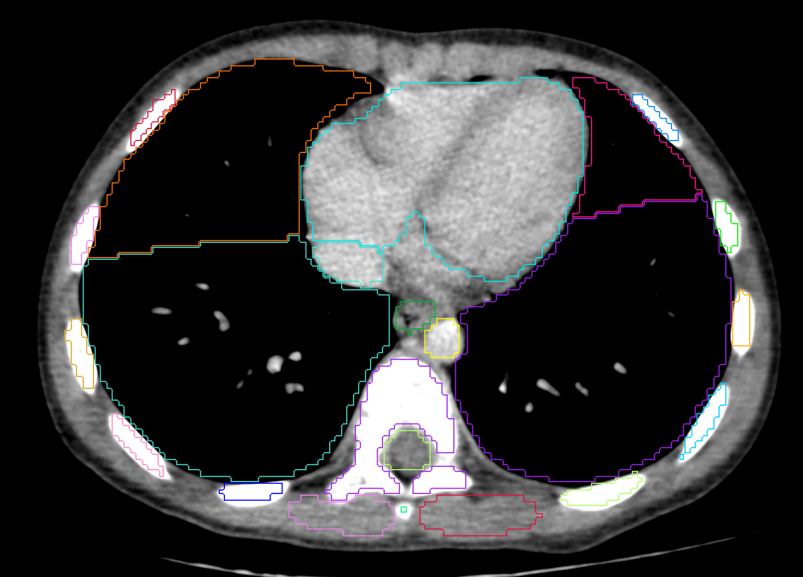
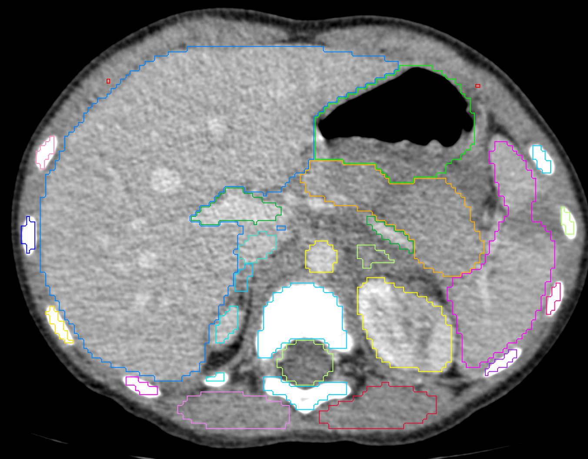
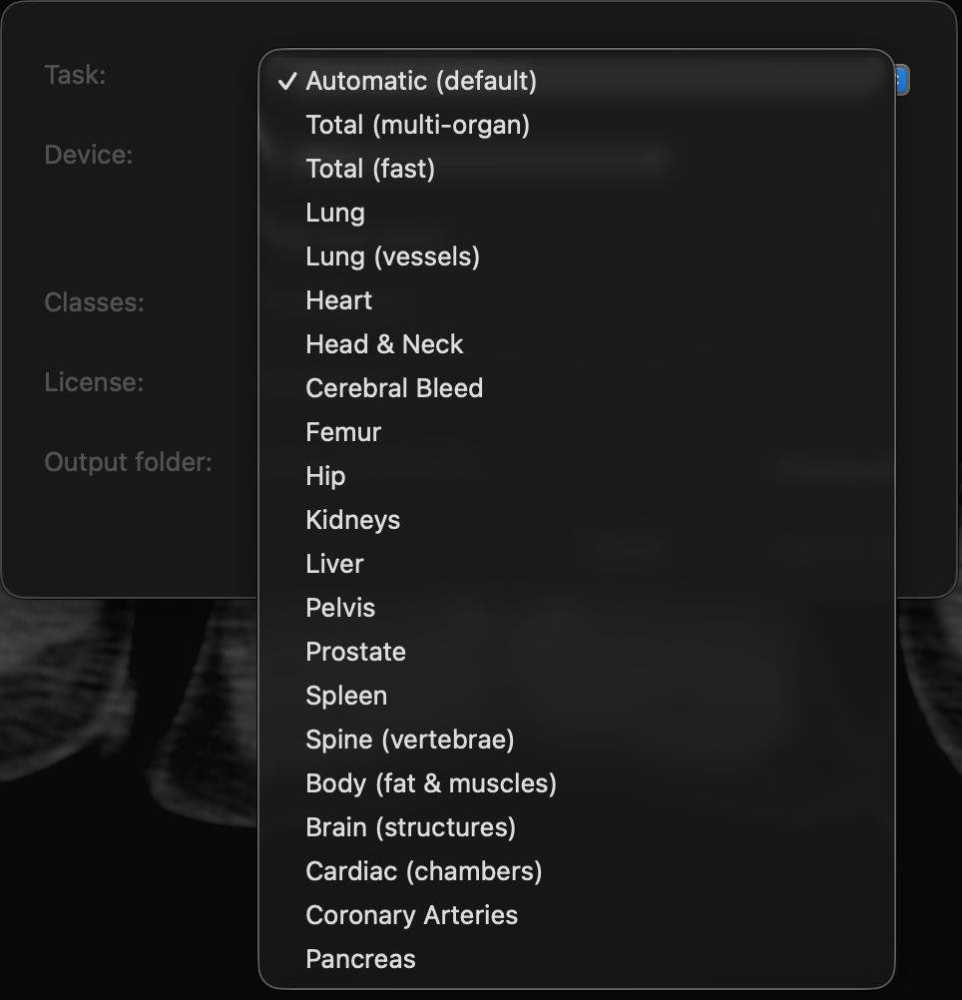

# TotalSegmentator Horos Plugin (WIP)

> ⚠️ **Work in Progress**: this repository hosts an evolving prototype of the *TotalSegmentator* plugin for Horos. We are validating the integration, refining the UI, and tuning the post-processing workflow. Expect frequent changes, unstable APIs, and partially implemented features.

---

## Overview

This project brings the [TotalSegmentator](https://github.com/wasserth/TotalSegmentator) pipeline into Horos/OsiriX via a native plugin. It exports the active series, launches the segmentation in Python (nnUNet/TotalSegmentator), re-imports the outputs as RT-Struct, and reapplies the ROIs to the current Horos viewer.

The repository still ships the official TotalSegmentator sources (`totalsegmentator/`) because the plugin reuses internal scripts and helpers, but the primary focus of this fork is the Horos plugin.

---

## Current Status

- ✅ End-to-end export → segmentation → import flow works for 2D CT/MR series.
- ✅ Isolated Python environment bootstrapped under `~/Library/Application Support/TotalSegmentatorHorosPlugin`.
- ✅ RT-Struct overlays applied to the active viewer (Horos ≥ 4.0.1 required).
- ⚠️ Configuration UI is minimal; advanced class selection is still limited.
- ⚠️ Horos must be running in English to avoid localization issues in menus.
- 🚧 Automated tests and formal distribution (installer `.pkg`) are not yet available.

---

## Screenshots







---

## Requirements

- macOS 14 or newer (validated on macOS 15.0.1).
- Horos 4.0.1 (build 20231016) or compatible OsiriX-based host.
- Xcode 15/16+ with Swift 5 toolchain.
- Python 3.9 or 3.13 available (the plugin provisions its own virtualenv).
- Optional GPU; CPU mode works but is faster with `--fast`.

---

## Quick Build & Install

1. **Clone the repository**
   ```bash
   git clone https://github.com/<your-username>/TotalSegmentator.git
   cd TotalSegmentator
   ```

2. **Build the plugin**
   ```bash
   xcodebuild \
     -project MyOsiriXPluginFolder-Swift/TotalSegmentatorHorosPlugin.xcodeproj \
     -configuration Release \
     -target TotalSegmentatorHorosPlugin \
     build
   ```

3. **Install into Horos**
   ```bash
   PLUGIN_SRC="MyOsiriXPluginFolder-Swift/build/Release/TotalSegmentatorHorosPlugin.osirixplugin"
   PLUGIN_DST="$HOME/Library/Application Support/Horos/Plugins/"

   rm -rf "$PLUGIN_DST/TotalSegmentatorHorosPlugin.osirixplugin"
   cp -R "$PLUGIN_SRC" "$PLUGIN_DST"
   codesign --force --deep --sign - "$PLUGIN_DST/TotalSegmentatorHorosPlugin.osirixplugin"
   ```

4. **Launch Horos** and confirm the entry under `Plugins ▸ Plugin Manager ▸ TotalSegmentator`.

---

## Using the Plugin in Horos

1. Open a study and ensure the active series is 2D (CT or MR).
2. Choose `Plugins ▸ TotalSegmentator ▸ Run TotalSegmentator`.
3. Adjust the basic settings (task, device, output) and press **Run**.
4. Watch the progress window. On success the plugin:
   - imports the generated DICOM files,
   - builds the RT-Struct objects,
   - applies the ROIs to the active viewer.

> **Tip:** to transfer RT-Struct to another workstation, export the newly imported objects from Horos after the segmentation finishes.

---

## Troubleshooting

| Symptom | Common Cause | Action |
| --- | --- | --- |
| Plugin missing from menu | Bundle not copied/signed correctly | Re-run installation steps and check permissions |
| “rt_utils” missing error | Python dependency absent | Execute `~/Library/.../PythonEnvironment/bin/pip install rt_utils` |
| No ROIs applied | RT-Struct failed to load | Inspect `Window ▸ Logs ▸ TotalSegmentator` and ensure a 2D series is open |
| Python env corrupted | Interrupted during virtualenv setup | Delete `~/Library/Application Support/TotalSegmentatorHorosPlugin` and run the plugin again |

---

## Development Notes

- Core plugin logic: `MyOsiriXPluginFolder-Swift/Plugin.swift`.
- Interface files (XIB): `Settings.xib`, `RunSegmentationWindowController.xib`.
- Python helpers (bridge, converters): generated on the fly in the plugin’s temporary workspace.

### Coding Guidelines
- Swift 5 with `swift-format` where available.
- Comments only for non-obvious blocks; emphasize readable implementation.
- Avoid adding extra bundled dependencies—reuse Horos frameworks whenever possible.

---

## Repository Layout

```
MyOsiriXPluginFolder-Swift/     # Horos plugin sources
Screenshots/                    # Images used in this README
totalsegmentator/               # Original TotalSegmentator codebase (reference)
resources/                      # Artwork and diagrams inherited from upstream
tests/                          # TotalSegmentator test suite (not plugin-specific yet)
```

---

## Roadmap

- [ ] Advanced preferences panel with class selection via TotalSegmentator API.
- [ ] Support volumetric multi-frame series and MPR viewers.
- [ ] Automate packaging as `.pkg` with pre-provisioned Python environment.
- [ ] Add smoke-test harness that triggers the plugin headlessly.

---

## Credits & License

- **Author**: Thales Matheus Mendonça Santos — October 2025.
- **TotalSegmentator**: University Hospital Basel, Apache 2.0.
- **Horos**: open-source project derived from OsiriX.
- **Horos Plugin Code**: (c) 2025, TotalSegmentator Horos Plugin community. Additional code follows Apache 2.0 unless otherwise noted.
- **Acknowledgements**: thanks to the OsiriX team for the OsiriX plugin template that kick-started this project.

Licensed under the Apache License, Version 2.0 (the "License"); you may not use this file except in compliance with the License. You may obtain a copy of the License at

```
   http://www.apache.org/licenses/LICENSE-2.0
```

Unless required by applicable law or agreed to in writing, software distributed under the License is distributed on an "AS IS" BASIS, WITHOUT WARRANTIES OR CONDITIONS OF ANY KIND, either express or implied. See the License for the specific language governing permissions and limitations under the License.

Contributions are welcome! Please open issues or pull requests with details about your test environment (macOS version, Horos build, Python version).
